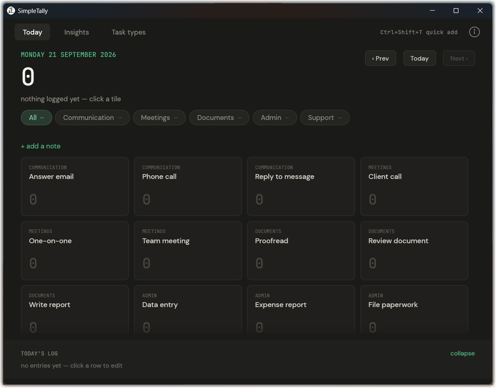
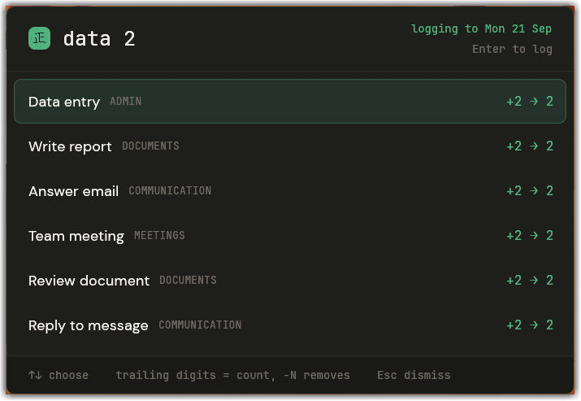

# SimpleTally

A small desktop app for counting the work you do, one tap at a time.



SimpleTally keeps a running tally of tasks by type and by day, then adds them up
into the numbers you need for workload analysis. It's built for work that's a
stream of small, repeatable tasks, where the question at the end of the quarter
is always "how much of each did we handle?". If your days look like that, this
might fit.

It runs on Windows, keeps everything in a single file next to the program, and
never talks to the internet.

## What it does

- **Tap to count.** The Today screen shows your task types as tiles grouped by
  category. Click a tile to add one; the day's total updates as you go. The
  number keys 1-9 tally the first nine tiles, so a busy stretch is just a few
  keystrokes.
- **A quick-add popup that stays out of your way.** Press `Ctrl+Shift+T` from
  anywhere and a small search box appears over whatever you're doing. Type a few
  letters, hit Enter, and the tally is recorded without the main window ever
  coming to the front. Add several at once by typing a number ("answer email 3"),
  or correct a miscount by subtracting ("meeting -1").

  

- **Insights that answer the quarterly question.** Pick a week, month, quarter,
  year, or a custom range, and see how many of each task type you handled, which
  categories carried the load, and how it compares to the range before. Every
  range exports to CSV, because the real analysis usually happens in a
  spreadsheet.
- **Task types you control.** Add, rename, deactivate, or reorganise your task
  types and their categories. Import a list from CSV to get started, or export
  one to share. Deleting a type doesn't destroy its history: it goes to the
  trash, where it can be restored with every tally intact until you choose to
  purge it.
- **Backups you can actually keep.** Take a full snapshot of everything as a
  single portable file, or export just your task types as CSV, whenever you like.

## Getting started

SimpleTally is a single portable program. There's nothing to install.

1. Download `SimpleTally.exe` from the
   [Releases](https://github.com/majimawrks/simpletally/releases) page.
2. Put it wherever you'd like to keep it, ideally in its own folder.
3. Run it.

On first launch it creates its database (`task_tally.db`) right beside the
program and opens on an empty Today screen.

### Setting up your task types

Before you can tally anything, SimpleTally needs to know what your tasks are. You
have two ways to add them, both on the **Task types** tab:

- **Type them in** one at a time with the **New type** button.
- **Import a list from CSV**, which is much faster if you already know your tasks.
  The file just needs three columns, `Category`, `Name`, and `Description`, and
  the categories are created for you as they're read.

To see how it works, import the starter list of common office tasks in
[`templates/office-tasks.csv`](templates/office-tasks.csv), then rename, remove,
or add to it until it matches your own work. You can export your list back to CSV
at any time, so it's easy to tweak it in a spreadsheet and re-import.

Closing the window doesn't quit the app: it tucks it into the system tray so the
quick-add hotkey keeps working. You'll see a one-time note explaining this the
first time it happens, with a switch to make the close button quit for real if
you'd rather.

### Coming from an older version

If you used an earlier build of the tally system, SimpleTally can bring your old
data across. On first run it looks for a previous database nearby and offers to
import it; you can also do this any time from the tray menu under
**Migrate old data**. Your original file is left untouched.

## Your data

Everything lives in one file, `task_tally.db`, in the same folder as the program.
Move the folder and your data moves with it. Nothing is stored anywhere else, and
nothing leaves your machine.

Two kinds of backup are available from the archive button on the **Task types**
tab:

- **Back up all data** writes a complete `.tally` snapshot (this is a standard
  SQLite database, just renamed) that can be restored later in full.
- **Back up task types** writes a CSV of your types and categories that the app
  can read back in, handy for setting up a second machine or sharing a starting
  list.

## Building from source

You'll need a recent [Rust toolchain](https://rustup.rs/) on Windows (MSVC).

```
cargo build --release
```

The program ends up at `target/release/SimpleTally.exe`. That's the whole build;
there are no external assets to copy or services to run.

## Under the hood

SimpleTally is written in Rust, draws its interface with
[egui](https://github.com/emilk/egui), and stores data in SQLite. It's a single
self-contained executable with no runtime dependencies.

## License

Released under the [MIT License](LICENSE). Copyright (c) 2026 majimawrks.

Built by majima, with AI assistance.
